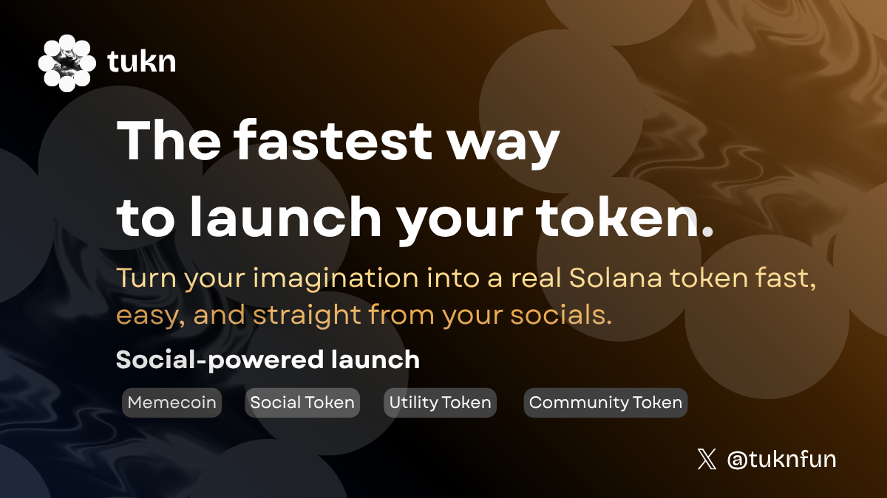

# Tukn — Create & Launch Solana Tokens Directly from X (Twitter)

Tukn is a launchpad that lets anyone create and launch tokens/memecoins directly from their socials (X) in just a few seconds. Built on Solana Blinks, it enables seamless on-chain token creation right from your feed, making the process fast, simple, and effortless.

Imagine you’re scrolling through X and suddenly get an idea for a memecoin — instead of opening a new tab, setting up code, or deploying contracts,  
you simply interact with a **Tukn Blink post**, fill in your token details, and hit “Create.” 
Within seconds, your token is live on Solana — all without ever leaving your feed. 🎯


<h3 style="color:#ff4444;">To View the Blink Properly on X</h3>

Make sure these two things are in place 👇

1. Use a <span style="color:#ff4444;" >**desktop browser**</span> (Blinks won’t appear on mobile).  
2. Enable the <span style="color:#ff4444;" >**Blink Experimental Feature**</span> in your Solana wallet setting (e.g., Phantom or Backpack).  

Once done, the Tukn Blink will unfurl and become interactive directly on X. 


<p align="center">
  <a href="https://tukn.vercel.app/" target="_blank">
    
  </a>
  <a href="https://x.com/tuknfun/status/1984352846545125474" target="_blank">
    
  </a>
  <a href="https://www.youtube.com/watch?v=E13Z5g1-EIc" target="_blank">
    
  </a>
  <a href="https://x.com/tuknfun" target="_blank">
    
  </a>
</p>


<p align="center">
  
</p>


## Demo

See how easy it is to launch your token in seconds with **Tukn**
<p align="center">
<video  width="640" height="360" controls>
  <source src="./public/tukn-video.mp4" type="video/mp4">
  Your browser does not support the video tag.
</video>
</p>


## Features

- **Instant Token Creation:** Create Solana SPL tokens or memecoins in seconds — no code, no setup required.  
- **Social Integration (Blinks):** Launch tokens directly from X (Twitter) using Solana Blinks — without leaving your feed.  
- **IPFS Metadata Storage:** Token metadata (name, symbol, description, logo) stored securely on IPFS via Pinata.  
- **Custom Token Parameters:** Set your own name, symbol, decimals, initial supply, description, and logo URL.  
- **Metaplex Integration:** Uses Metaplex Token Metadata standards for full ecosystem compatibility.  
- **Secure Wallet Interaction:** Uses your browser wallet (Phantom, Backpack, etc.) directly to sign transactions safely.  
- **Transaction Confirmation:** Real-time confirmation and feedback once your token is minted successfully.  
- **Deployed & Public:** Hosted on Vercel and live on Solana Devnet — accessible via Dialect Blink interface.  


## Tech Stack

- **Framework**: Next.js 15 with App Router
- **Blockchain**: Solana (Devnet/Mainnet)
- **Token Standard**: SPL Token with Metaplex Metadata
- **Storage**: IPFS via Pinata
- **Actions**: Solana Actions (Blinks) v2.2.1
- **TypeScript**: Full type safety

## Prerequisites

- Node.js 18+ 
- Solana wallet (Phantom, Backpack, etc.)
- Pinata account for IPFS storage
- Solana RPC endpoint (optional, defaults to public devnet)

## Quick Start

### 1. Clone the Repository
```bash
git clone https://github.com/PrajwalGraj/Tukn.git
cd Tukn
```

### 2. Install Dependencies
```bash
npm install
# or
yarn install
# or
pnpm install
```

### 3. Environment Setup
Create a `.env.local` file in the root directory:
```env
# Solana RPC endpoint (optional, defaults to devnet)
SOLANA_RPC=https://api.devnet.solana.com

# Pinata JWT for IPFS storage
PINATA_JWT=your_pinata_jwt_token_here
```

### 4. Run Development Server
```bash
npm run dev
# or
yarn dev
# or
pnpm dev
```

Open [http://localhost:3000](http://localhost:3000) to see the application.

## Configuration

### Environment Variables

| Variable | Description | Required | Default |
|----------|-------------|----------|---------|
| `SOLANA_RPC` | Solana RPC endpoint | No | `https://api.devnet.solana.com` |
| `PINATA_JWT` | Pinata JWT token for IPFS | Yes | - |

### Getting Pinata JWT
1. Sign up at [Pinata](https://pinata.cloud/)
2. Go to API Keys section
3. Create a new JWT token
4. Add it to your `.env.local` file

## API Endpoints

### Token Creation Action
- **GET** `/api/actions/token/create` - Returns action metadata
- **POST** `/api/actions/token/create` - Creates token transaction
- **OPTIONS** `/api/actions/token/create` - CORS preflight

### Transaction Confirmation
- **POST** `/api/actions/token/confirm` - Confirms transaction status
- **OPTIONS** `/api/actions/token/confirm` - CORS preflight

## Usage

### As a Blink (Social Integration)
1. Share your deployed URL on Twitter
2. Users can interact directly with the Blink
3. Fill in token parameters (name, symbol, supply, etc.)
4. Sign the transaction with their wallet
5. Token is created and minted to their wallet

### Token Parameters
- **Token Name**: Full name of your token
- **Token Symbol**: Short symbol (e.g., BTC, ETH)
- **Decimals**: Number of decimal places (0-6)
- **Initial Supply**: Number of tokens to mint
- **Description**: Token description for metadata
- **Logo URL**: Direct URL to token logo image (.jpg/.png)

## Project Structure

```
├── app/
│   ├── api/
│   │   └── actions/
│   │       └── token/
│   │           ├── create/
│   │           │   └── route.ts     # Token creation endpoint
│   │           └── confirm/
│   │               └── route.ts     # Transaction confirmation
│   ├── globals.css
│   ├── layout.tsx
│   └── page.tsx
├── public/
│   └── tukn-img.png                 # Blink icon
├── .env.local.example               # Environment template
├── .gitignore
├── next.config.ts
├── package.json
├── tailwind.config.ts
└── README.md
```

## Deployment

### Vercel (Recommended)
1. Push your code to GitHub
2. Import project in [Vercel](https://vercel.com)
3. Add environment variables in Vercel dashboard
4. Deploy!

### Environment Variables for Production
Make sure to set these in your deployment platform:
```env
SOLANA_RPC=
PINATA_JWT=
```

## 📄 License

This project is licensed under the MIT License - see the [LICENSE](LICENSE) file for details.

---

**Built with ❤️ for the Solana ecosystem**
